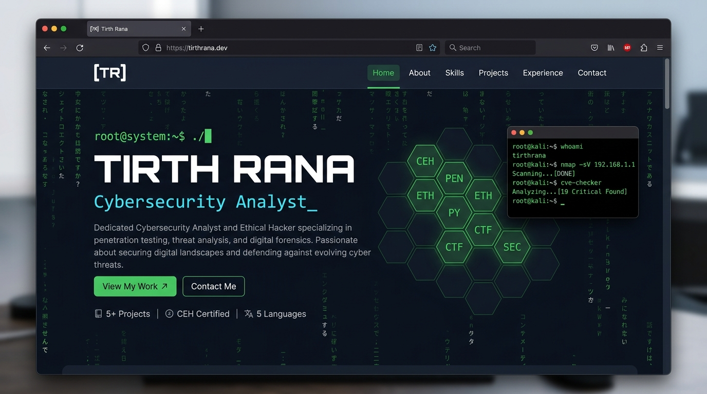
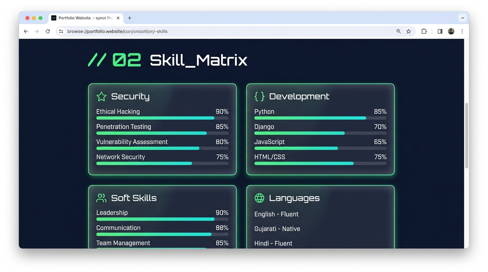
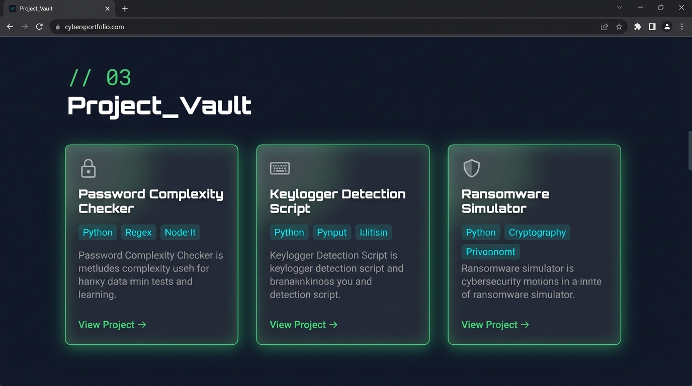

# Tirth Rana — Cybersecurity Portfolio 🛡️

> **Live Site:** [ranatirth007.github.io](https://ranatirth007.github.io)

A cyber-themed personal portfolio website built with pure HTML, CSS & JavaScript.

## ✨ Features
- 🎨 Matrix rain animated background
- 🖱️ Custom glowing cursor with hover enlargement effect
- ⌨️ Typewriter hero animation with cycling roles
- 💻 Live terminal widget simulation
- 🃏 Glassmorphism cards with 3D tilt effect
- 📊 Animated skill bars on scroll
- ✉️ Working contact form (Formspree)
- 📱 Fully responsive design

## 📸 Screenshots

### Hero Section

### Skill Matrix

### Project Vault

## 🛠️ Tech Stack
- HTML5, CSS3 (Glassmorphism, CSS Variables, Animations)
- Vanilla JavaScript (Canvas API, IntersectionObserver, Fetch API)
- Google Fonts: Orbitron · Share Tech Mono · Rajdhani
- Formspree (contact form backend)

## 📬 Contact
- Email: tirthrana1240@gmail.com
- LinkedIn: [tirthrohitrana](https://www.linkedin.com/in/tirthrohitrana)
- GitHub: [ranatirth007](https://github.com/ranatirth007)